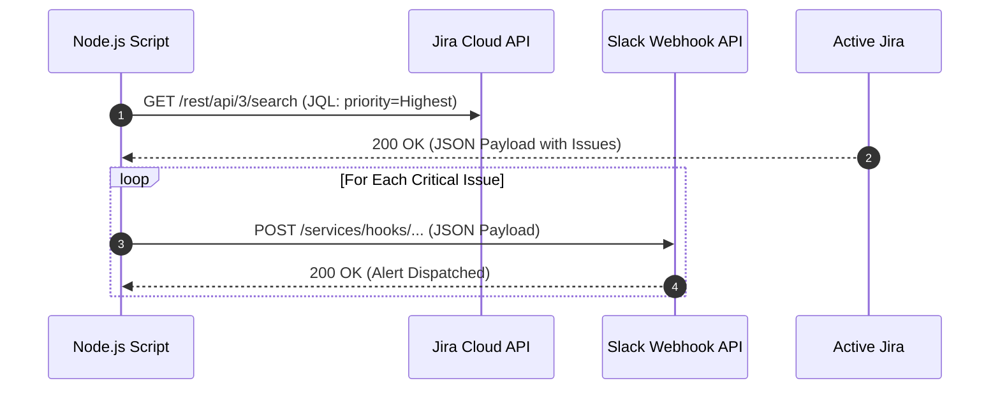

# Jira Cloud to Slack Automation Snippet 

A lightweight Node.js automation script that integrates Jira Cloud REST API with Slack Webhooks. It scans Jira for newly created issues with a specific critical priority and automatically broadcasts structured alerts to a designated Slack channel.

## Architecture Workflow


## Key Features
Automated Triaging: Uses Jira Query Language (JQL) to filter out high-priority bottlenecks dynamically.

REST API Integration: Implements clean GET and POST asynchronous HTTP requests using the native Fetch API.

Security First: Strictly architecture-compliant. No hardcoded credentials; utilizes environment variables (.env) and .gitignore safety measures.

## Setup & Installation
### 1. Clone the repository:
```bash
git clone https://github.com/YOUR_USERNAME/jira-cloud-automation-snippets.git
```
### 2. Install dependencies:
```bash
npm install
```
### 3. Configure Environment Variables:
Create a .env file in the root directory:
```bash
JIRA_EMAIL=your-email@example.com
JIRA_TOKEN=your_jira_api_token
SLACK_WEBHOOK_URL=https://hooks.slack.com/services/T00/B00/X
```
### 4. Run the script:
```bash
npm start
```
